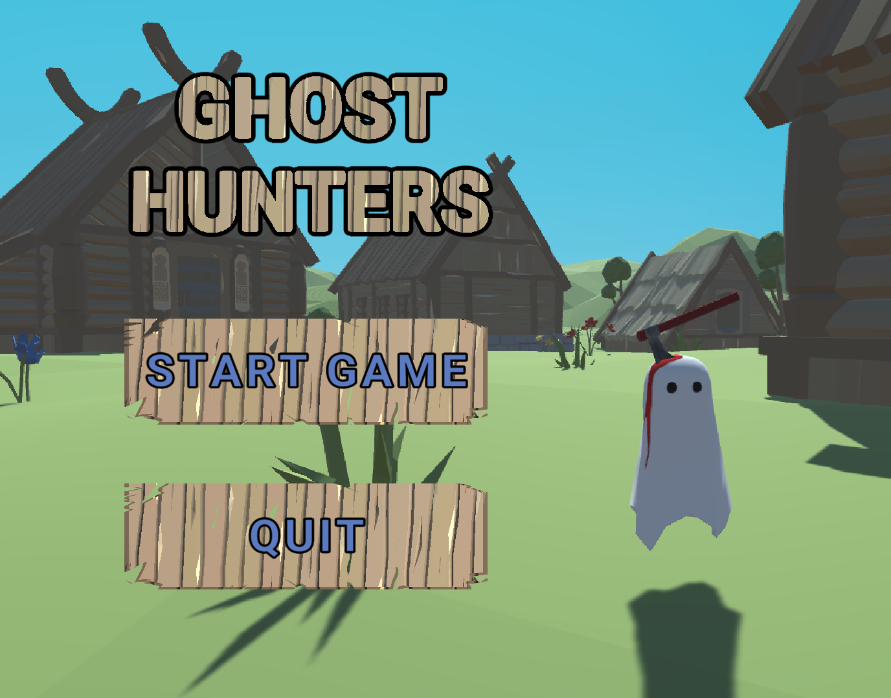
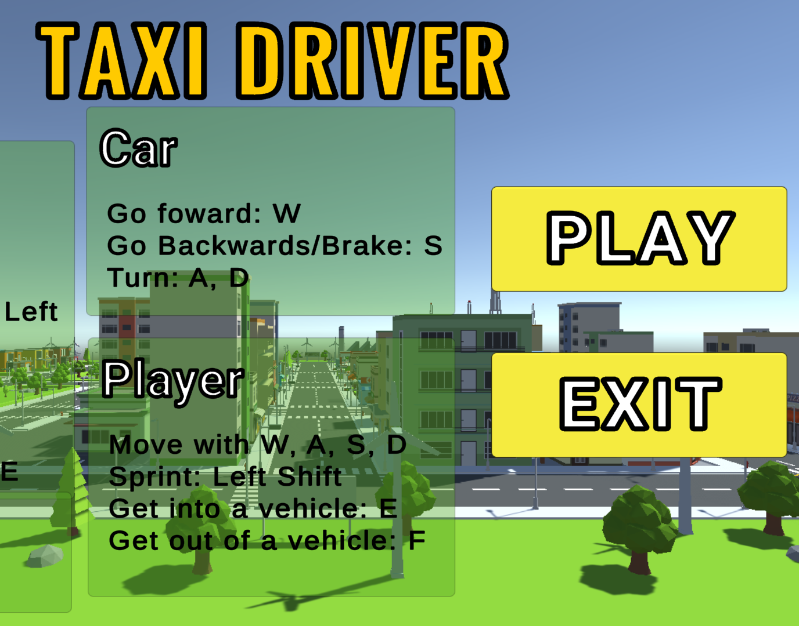
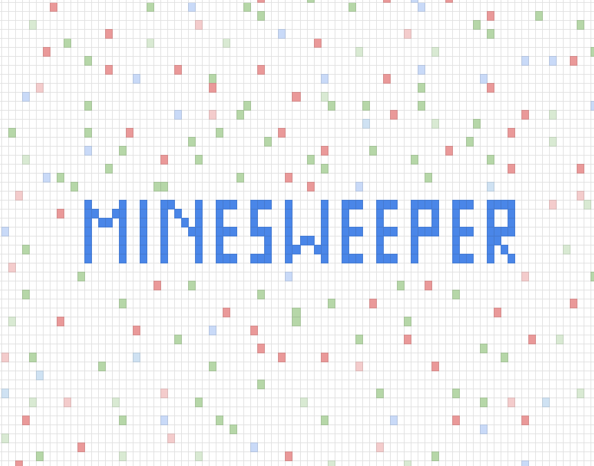
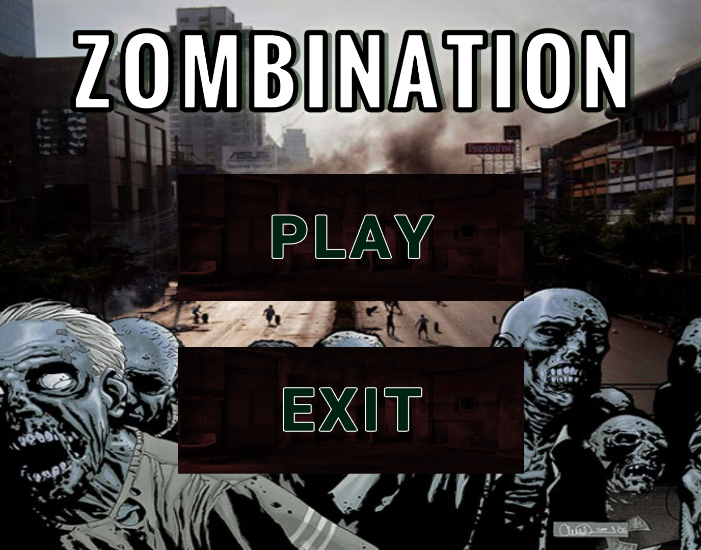

## Hi there! 👋

I'm Isa, a passionate videogame programmer! 🎮

I specialize in creating engaging, interactive experiences, and I've been programming since 2017. My journey began with app and web development, but in 2023, I transitioned into my true passion: videogame programming.
About what I do:
- **Videogame Development**: Turning ideas into immersive gaming experiences since 2023
- **AR/VR Development**: Exploring virtual worlds with Meta Quest, Vuforia, and more since 2023
- **Web Development**: Making functional, interactive webs since 2021.
- **App Development**: Crafting functional, responsive applications since 2018.

## Tech Stack:

  
| Game Development  | Augmented & Virtual Reality | Web Development | App Development |
| ------------- | ------------- |  ------------- |  ------------- |
|    |  |     |   |
|    |  |     |   |
|   |  |    |  |
|   |    |    |   |

**I’m always looking for new challenges and ways to grow, so feel free to connect or explore my repositories!**

 <h2>Featured videogame projects:</h2>

  
| GHOST HUNTERS| TERRAIN GENERATOR | VR ESCAPE DUNGEON | WANTED |
| ------------- | ------------- |  ------------- |  ------------- |
| |  | |   |
|   |    |    |   |
| 3D   Character Controller   Game pause   Inventory and shop   Unity & C# | 3D   Terrain Painting   Terrain Generation   Unity & C# |  VR   Unity XR   Meta Integration   Unity & C# |  3D   AI & Ai State Machines   NavMesh   Unity & C#  |
| A small shooter game whose objective is to free a once peaceful village from the cute but dangerous ghosts that inhabit it now.  Destroy ghosts and use the money to buy weapons, bullets, and health items to see how long you can survive. | With this project you can generate different simple landscapes playing with terrain detail, seed and water height. Try multiple settings to see how the terrain turns out |  Use a VR set to solve puzzles and advance between rooms to get out of a dungeon. After being locked you will have to explore rooms and interact with props and objects to try and get out of this weird place. |  Small game about taging a NPC in a group of lookalikes. Find the wanted NPC and tag it before time ends! There are 4 difficulty levels, try and get the max points in hell mode competying against time and crazy bumps of the one hundred NPCs. ||

 <h2>Other projects:</h2>

  
| Project Name  | Project Image  | Description  | Links  |
|---------------|----------------|--------------|--------------|
| A FOREST STORY    | | 2D  Sprite use   Basic enemy control   Unity & C#  |  |
| DUNGEON GENERATOR    | | 3d   Matrix use   Random generation   Unity & C#   |  |
| ALL TAXI     | | 3D   Driving mechanics  Flying mechanics   Unity & C# |  |
| MINESWEEPER  | | 2D   Matrix use   Random generation   Unity & C# |  |
| ZOMBINATION  |  | 3D   Character Controller   3D Animations   Unity & C# |  |
| BOWLING VR  | | VR   Unity XR   Meta integration   Unity & C# |  |

<!--
| Project 2     | | Descr |  |-->
  

<!--

Game Description

Blavlvllvlalvl

| **GHOST HUNTERS**    | **Project Name**    | **Project Name**    | **Project Name**    |
|---------------------|---------------------|---------------------|---------------------|
|  | | | |
| A small shooter game whose objective is to free a once peaceful village from the cute but dangerous ghosts that inhabit it now.  Destroy ghosts and use the money to buy weapons, bullets, and health items to see how long you can survive.  |Small game about taging a NPC in a group of lookalikes. Find the wanted NPC and tag it before time ends! There are 4 difficulty levels, try and get the max points in hell mode competying against time and crazy bumps of the one hundred NPCs. |This is a description of the project. It explains the key details and purpose. |This is a description of the project. It explains the key details and purpose. |

Ghost Hunters:

Wanted:

Terrain Generator:

VR ScapeRoom: 

-->
<!--
| Project Name  | Project Image  | Description  |
|---------------|----------------|--------------|
| Project 1     |  | This is a short description of project 1. |
| Project 2     |  | This is a short description of project 2. |
-->

<!-- Add the photos of the technologies or examples and redirect to itch.io

TO DO: ADD LINKS TO ITCH.IO AND MORE VISIBLE LINKT TO GITHUB

TO ADD: 

Estructura:
Juego shooter
Juego VR
Juego Tag con IA
Juego generacion de terreno

Otros:
Juego 2d
Juego zombies
Generación mazmorra 
BuscaMinas
Juego taxi

Juego de VR

**Game Development:**
- Unity, Godot
- C#, GDScript

**Augmented & Virtual Reality:**
- Oculus/Meta Quest and adaptable VR solutions compatible with various headsets
- Vuforia, AR Foundation, Unity XR, Meta XR

**Web Development:**
- Angular, React, Vue
- JavaScript, TypeScript
- Bootstrap, SASS 
- HTML5, CSS

**App Development:**
- Android Studio (Java, Kotlin)
- Python
-->

<!--
**isabelcoboruizazuaga/isabelcoboruizazuaga** is a ✨ _special_ ✨ repository because its `README.md` (this file) appears on your GitHub profile.

Here are some ideas to get you started:

- 🔭 I’m currently working on ...
- 🌱 I’m currently learning ...
- 👯 I’m looking to collaborate on ...
- 🤔 I’m looking for help with ...
- 💬 Ask me about ...
- 📫 How to rea
ch me: ...
- 😄 Pronouns: ...
- ⚡ Fun fact: ...
-->
